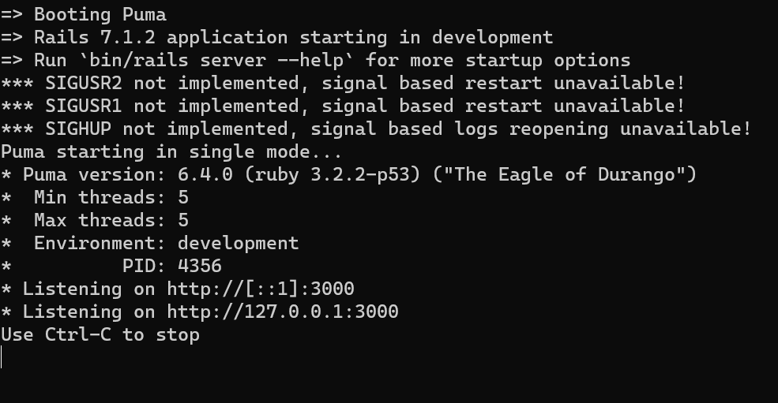

# CVWO Assignment backend

Backend submission by Ng Zi Xin. It is mostly completed, with minor code cleanup and documentation. Do let me know of any improvements I can make, thank you.

## Getting Started

1. [Fork](https://docs.github.com/en/get-started/quickstart/fork-a-repo#forking-a-repository) this repo.

2. [Clone](https://docs.github.com/en/get-started/quickstart/fork-a-repo#cloning-your-forked-repository) **your** forked repo.

3. Open your terminal and navigate to the directory containing your cloned project.

4. Check your Ruby version
```shell
ruby -v
```
The ouput should start with something like `ruby 3.2.2`
If not, install the right ruby version using [rbenv](https://github.com/rbenv/rbenv) (it could take a while):
```shell
rbenv install 3.2.2
```

5. Install dependencies for the project by entering this command:
```shell
bundle install
```

6. Edit **config/initializers/cors.rb** to add your frontend client url(s).
   

7. Edit **config/database.yml** to configure postgres database. For more information, refer to this [tutorial](https://www.digitalocean.com/community/tutorials/how-to-use-postgresql-with-your-ruby-on-rails-application-on-ubuntu-20-04).

8. Initialize the database
```shell
rails db:create db:migrate db:seed
```

9. Run the app in development mode by entering this command:
```shell
rails server
```

10. You should see a page like this.
   

11. Proceed to [frontend set-up](https://github.com/NgZiXin/CVWO-Frontend).

